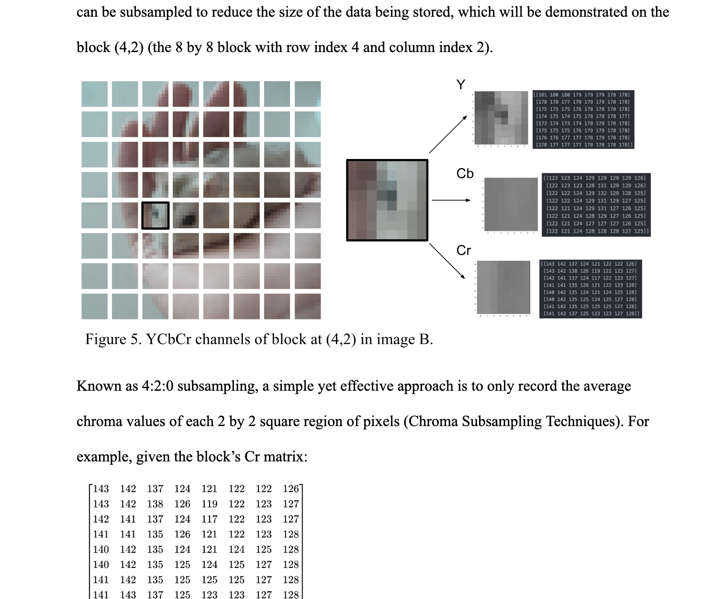

# Investigating the JPEG Algorithm, with semi-implementation and interface

Created an applet for compressing and decompressing JPEG image files. Would not call it a finished project, but nevertheless I worked on this tangentially to my mathematical investigation into the JPEG image compression algorithm for IB coursework. Some of the mathematical calculations in that essay were tested and verified by the code I wrote in this repository.

If you would like to learn more about the JPEG algorithm and the mathematical investigation as a whole, I would highly recommend that you read **"Mathematics_IA.pdf"** which explains the project/investigation in full. Below is a very short excerpt from this essay:

---

---

Please note that the applet itself is very buggy, and is prone to visual artefacts in decompressed images.